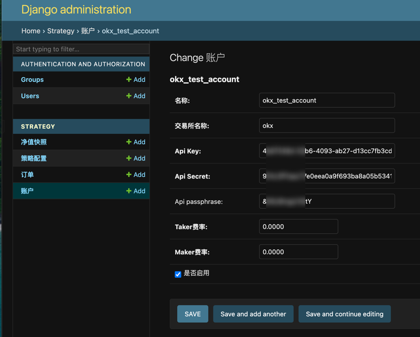

<h1 align="center">
  <br>okx_spot_future_arbitrage<br>
</h1>

[中文](README_CN.md) | English

# Introduction
Spot-Future Arbitrage: Spot-future arbitrage refers to the process of buying the lower-priced asset and selling the higher-priced asset when there is a significant price difference between futures and spot markets for the same cryptocurrency. Profits are realized by closing positions when the price gap narrows.

The market uses OKX spot leverage and coin-margined contracts

    Spot leverage orders
    Coin-margined delivery contracts for hedging

Annual yield = (future_price - spot_price) / spot_price / future_expire_days * 365 * 100%

Yield reference: https://www.okx.com/zh-hans/markets/arbitrage/spread-usd

# Before You Start
1. DYOR (DO Your Own Research)
2. Before formally using the strategy, it is recommended to test it in a demo account first to confirm the stability and yield of the strategy


# Preparation：
* Change the account to cross-margin (Upgrade to cross-margin mode requires the equity in the trading account to be not less than 10,000.00 USD)


# Core Strategy Logic

    The strategy module obtains real-time positions and fund balances through WebSocket
    The data processing module obtains real-time yield rankings
    Opening position logic:
        Process trading pairs in the yield ranking sequentially
        Check if the data is timed out (greater than a specified time, e.g., 10s)
            Skip if timed out
        Check if opening a position is currently allowed
            Is the strategy enabled
            Is spot USDT sufficient (balance > per_order_usd)
            Has the position limit been reached
            Does the yield meet the criteria
        Two-leg order placement
            Simple logic uses limit orders above market price, e.g., spot buys at asks[5], future sells at bids[5]
            Complex logic:
                Spot maker, place contract taker order after receiving WebSocket trade message. Price same as above. Risk point is rapid price movement
                Precision handling
                    Handle spot and contract price precision based on market data
                    Handle spot size precision based on market data
    Closing position logic
        Iterate through current positions, obtain corresponding yields, close positions with yields below the closing threshold
        Closing operation also involves two-leg order placement, executed simultaneously


# Project Deployment

###  dependent components:
  - redis = 6.x     (e.g. 6.2.6)
  - mysql = 8.0.x    (e.g. 8.0.31)
### env up

####  create mysql database or using make setenv auto create db
```
DROP DATABASE basis_alpha_db;
create database basis_alpha_db charset=utf8mb4;
```

#### install requirements

```
pip install -r requirements.txt
pip install -r requirements-dev.txt
```


####  initial default data
* Create admin user
```
python manage.py createsuperuser --role=admin
```
* Initialize database tables
```
python manage.py migrate
```

#### Configure account

Visit http://localhost:8000/admin/strategy/account/add/ to add an account
Note: The Api Secret field needs to use encrypted text, use tools/aes_encrypt.py for encryption



Add strategy configuration  


####  Start service
* Configure environment variables
TEST environment:
```
export PROFILE=dev
```
Production environment
```
export PROFILE=production
```
* Admin panel (account management, strategy configuration, order management)

```
python manage.py runserver
```

* Market data module
```
python manage.py start_okx_future_spot_spider
```
* Strategy module
```
python manage.py start_strategy --strategy_name test --account_name okx_test_account
```

Observe order execution status


### FAQ
## how to install mysqlclient
Exception: Can not find valid pkg-config name.

Install MySQL client and pkg-config using Homebrew:
brew install mysql-client pkg-config

Set the PKG_CONFIG_PATH environment variable:
export PKG_CONFIG_PATH="$(brew --prefix)/opt/mysql-client/lib/pkgconfig"

Install the mysqlclient package using pip:
pip install mysqlclient==2.2.4
